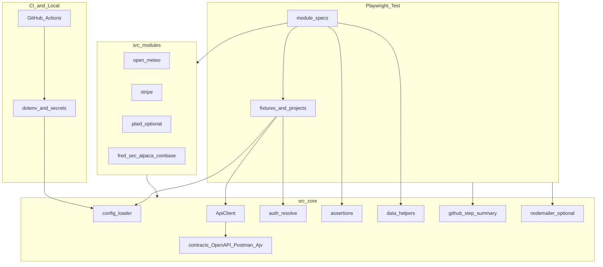
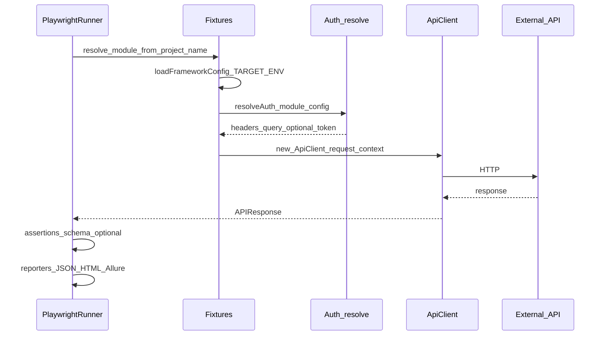
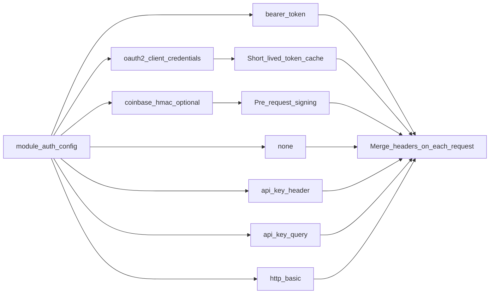

# Architecture

## Framework architecture

## Test execution flow

## Auth strategy flow

## Components

| Layer | Responsibility |
|------|----------------|
| `config/environments/*.ts` | Base URLs and defaults per `TARGET_ENV` |
| `src/core/config/load-config.ts` | Loads `.env`, resolves `ModuleName` config |
| `src/core/client/api-client.ts` | GET/POST/DELETE with auth merge, Stripe form & idempotency, Coinbase signing hook |
| `src/core/auth/auth-factory.ts` | Auth resolution + OAuth2 client-credentials cache + Coinbase HMAC pre-sign |
| `src/core/contracts/*` | OpenAPI validate, Postman v2.1 import, Ajv |
| `src/core/reporters/github-step-summary.ts` | Parses `test-results.json` for job summary |
| `global-teardown.ts` | Appends `GITHUB_STEP_SUMMARY`, optional email |

## Playwright projects

Each **project** maps to one `ModuleName` via [`tests/fixtures.ts`](../tests/fixtures.ts). This keeps parallelization simple and avoids cross-module leakage.
