# API Automation Architecture (Playwright + TypeScript)

```mermaid
flowchart LR
  A[Developer / CI Pipeline] --> B[npm run test:ci]
  B --> C[Playwright Test Runner]

  subgraph M[API Module Layer]
    M1[Weather API module]
    M2[Future Finance API module]
    M3[Future Exchange API module]
  end

  subgraph CFG[Config Layer]
    C1[environment config]
    C2[endpoint config]
    C3[test data config]
  end

  subgraph U[Utility Layer]
    U1[request builder]
    U2[response validator]
    U3[schema validator]
    U4[test data helper]
    U5[logger]
  end

  subgraph R[Execution Results]
    R1[JSON report]
    R2[Allure report]
    R3[dashboard]
  end

  subgraph N[Notification Layer]
    N1[Teams webhook notification]
  end

  subgraph O[Output]
    O1[pass/fail summary]
    O2[failed test details]
    O3[duration]
    O4[report link]
  end

  C --> M
  M --> U
  CFG --> U
  U --> R
  R --> N
  R --> O
  N --> O
```

## Overview

This architecture shows how a test run starts from a developer or CI trigger, executes through Playwright and module-specific API tests, uses shared config and utility components for consistent request/validation behavior, then produces reports and notifications.  
The output layer is intentionally business-friendly: it surfaces pass/fail status, failed test diagnostics, run duration, and direct report access.

## How to explain this in demo

In this framework, every run starts from one entry point: `npm run test:ci`, whether triggered locally or in CI.  
Playwright executes API modules, starting with the weather module and scaling to finance and exchange modules as coverage grows.  
Each test execution relies on shared config for environment, endpoints, and test data, and shared utilities for request building, validation, schema checks, and logging.  
From there, the framework generates JSON and Allure outputs plus a dashboard view, then posts a Teams notification for fast visibility.  
The audience can focus on four final outcomes: pass/fail summary, failed test details, total duration, and report link - everything needed for quick release decisions.
