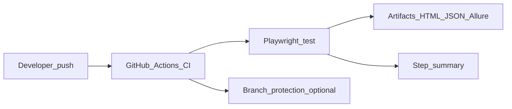

# CI/CD

## Workflows

| File | When | Purpose |
|------|------|---------|
| [`ci.yml`](../.github/workflows/ci.yml) | `push` / `pull_request` to `main`, `master`, `develop` | Full suite, artifacts, typecheck |
| [`nightly.yml`](../.github/workflows/nightly.yml) | Cron + `workflow_dispatch` | Scheduled regression; optional email on failure |
| [`publish-allure.yml`](../.github/workflows/publish-allure.yml) | `workflow_dispatch` | Regenerate Allure site artifact from a smoke subset |

## Secrets (optional modules)

Wire repository secrets matching the `env:` block in `ci.yml`. Missing secrets **skip** Stripe/Plaid/FRED/Alpaca tests by design.

## Email in Actions

1. Add SMTP credentials as secrets (`SMTP_HOST`, `SMTP_USER`, `SMTP_PASS`, …).  
2. Add repository secret `NOTIFY_ENABLED` = `true` for **nightly** (see workflow).  
3. Ensure `NOTIFY_FROM` / `NOTIFY_TO` are valid for your SMTP provider.

PR workflow (`ci.yml`) keeps `NOTIFY_ENABLED` off to avoid duplicate notifications.

## Branch protection suggestion

- Require `CI` workflow pass before merge.  
- Retain HTML + Allure artifacts for **14 days** (configurable).

## Diagram

