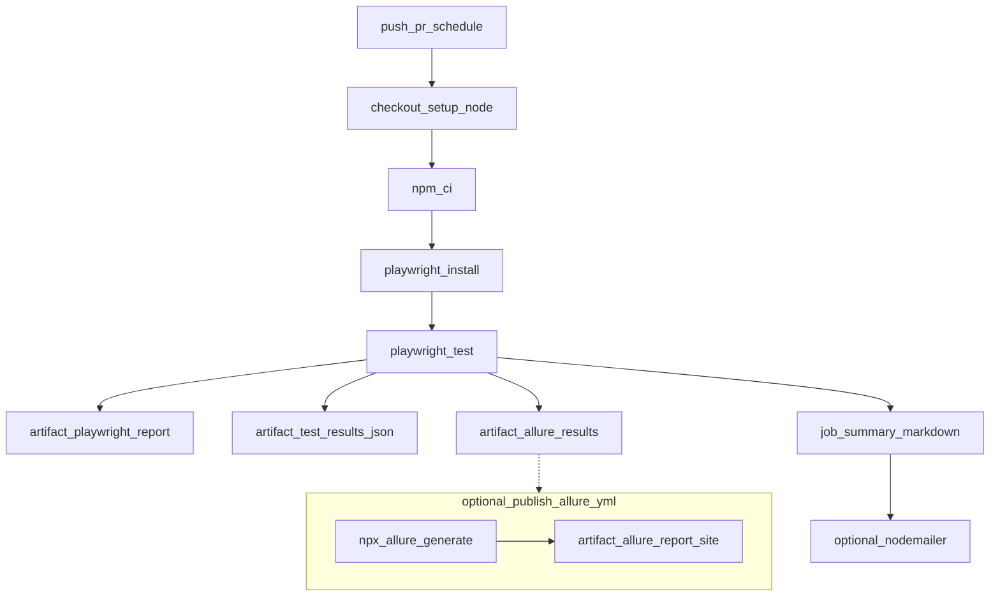

# Reporting

## Playwright built-ins

- **List** reporter — console output in CI.  
- **HTML** — `playwright-report/` (uploaded as an artifact).  
- **JSON** — `test-results.json` for programmatic summaries.  
- **Allure** — `allure-results/` via `allure-playwright`; build static HTML with `npm run report:allure`.

### Viewing the Allure report (important)

Allure’s UI loads JSON via **`fetch`**. If you open **`allure-report/index.html` with `file://`**, browsers block those requests (CORS / local file policy). You get empty widgets and **“500 Failed to fetch”** — **not** a broken test run.

**Do this instead:**

1. After tests: `npm run report:allure`
2. Start a local HTTP server: **`npm run report:allure:view`**
3. Open **`http://localhost:9292`** in your browser.

**One-shot from raw results** (generate + serve in one step, official CLI):

```bash
npm run report:allure:serve
```

That watches `./allure-results`, builds the report, and serves it (CLI prints the URL).

## GitHub Actions job summary

[`global-teardown.ts`](../global-teardown.ts) parses `test-results.json` and appends a Markdown table to `GITHUB_STEP_SUMMARY` (pass/fail/skip + duration). This satisfies the “concise job summary” requirement without a custom Playwright reporter class.

## Optional SMTP

When `NOTIFY_ENABLED=true` and SMTP env vars are set, teardown sends a short pass/fail email via Nodemailer. Keep this **off** on pull-request workflows to avoid noise; [`nightly.yml`](../.github/workflows/nightly.yml) is the natural place to enable it.

## CI/CD and report publishing flow



## Failure artifacts

On failure, CI uploads `test-results/` (traces, error context) for debugging.
