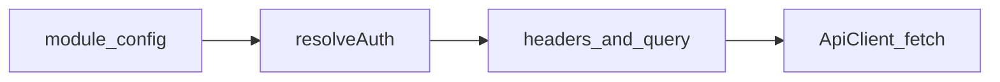

# Running tests

## Local

```bash
npm test
```

### By module (Playwright project)

```bash
npx playwright test --project=open-meteo
npx playwright test --project=stripe
npx playwright test --project=plaid
```

### By tag (grep)

Name tests with tags such as `@smoke` in the **suite title**, then:

```bash
npm run test:smoke
```

### Utilities

```bash
npm run verify:open-meteo-post
npm run import:postman
npm run build
```

## CI parity

`npm run test:ci` is the same entrypoint used in GitHub Actions (`CI=true`, retries enabled in config).

## Auth strategy flow (reference)



See [`docs/architecture.md`](architecture.md) for the full diagram set.
